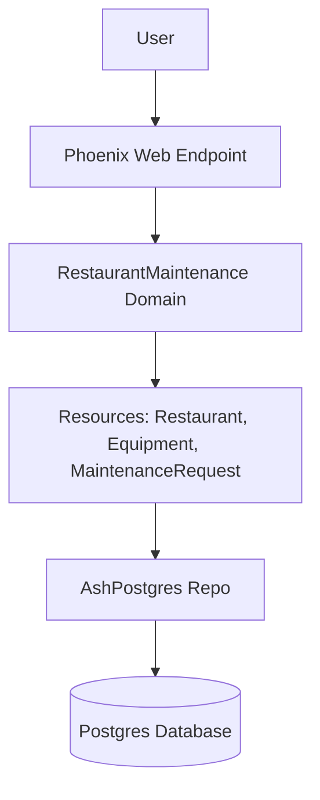

# Restaurant Maintenance App Architecture

- **User** interacts with the web endpoint.
- **Phoenix Web Endpoint** handles HTTP requests.
- **Domain** contains business logic.
- **Resources** define entities and actions.
- **Repo** communicates with the database.
